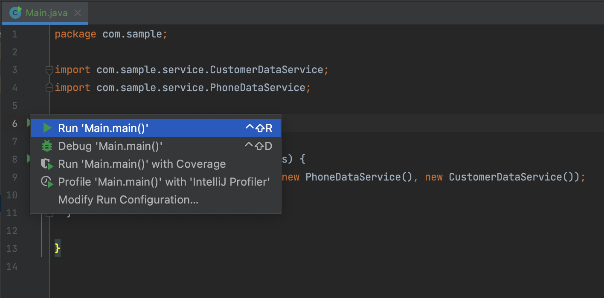

## Customer-Phone scanner simulator

This is very simple app simulating 1 customer - N phones operations.

## System Requirements
- JDK 17 (Java 17.0.2)
- Gradle 7.4
- Recommended running in MacOS or Linux
- Recommended using Intellij IDEA CE

## Building/Testing the app
```
./gradlew build
```
Build will also run tests. To run test only, run below:
```
./gradlew test
```

## Running the app
The below script will start the generated jar file
```
./run-jar.sh
```
Alternatively, you can start the app from the IDE:


## Interacting with the app
When starting the application, there will be a prompt that allows you to select and type in an action:
```
What do you want to do? Choose from: getAllPhones, getAllCustomers, getPhoneByCustomerId, activatePhone, exit
```
### getAllPhones
This option will show all phones from the datastore:
```
Phone {id: 1, customerId: 1, phoneNumber: 0409111222, isActive: true}
Phone {id: 2, customerId: 2, phoneNumber: 0409222333, isActive: true}
Phone {id: 3, customerId: 2, phoneNumber: 0409333444, isActive: false}
Phone {id: 4, customerId: 3, phoneNumber: 0409333444, isActive: true}
Phone {id: 5, customerId: 3, phoneNumber: 0421333444, isActive: false}
Phone {id: 6, customerId: 4, phoneNumber: 0421333444, isActive: false}
Phone {id: 7, customerId: 5, phoneNumber: 0421333444, isActive: true}
Phone {id: 8, customerId: 6, phoneNumber: 0421333444, isActive: false}
Phone {id: 9, customerId: 6, phoneNumber: 0421333444, isActive: true}
Phone {id: 10, customerId: 6, phoneNumber: 0421333444, isActive: false}
```
### getAllCustomers
This option will show all customers from the datastore:
```
Customer{id: 1, firstName: John, lastName: Doe}
Customer{id: 2, firstName: Kate, lastName: Millers}
Customer{id: 3, firstName: Mike, lastName: Hawthorn}
Customer{id: 4, firstName: Anna, lastName: Jones}
Customer{id: 5, firstName: Ted, lastName: Murray}
Customer{id: 6, firstName: Mary, lastName: King}
```
### getPhoneByCustomerId
This option will let you select a customer by id and see the list of phones associated with the customer.
```
Enter customer id
2
Phone {id: 2, customerId: 2, phoneNumber: 0409222333, isActive: true}
Phone {id: 3, customerId: 2, phoneNumber: 0409333444, isActive: false}
```
### activatePhone
This option will let you select a phone by id and activate the phone by switching `isActive` value to `true`
```
Enter phone id to activate
3
Activation complete for phone: Phone {id: 3, customerId: 2, phoneNumber: 0409333444, isActive: true}
```
### exit
This option will exit the application.